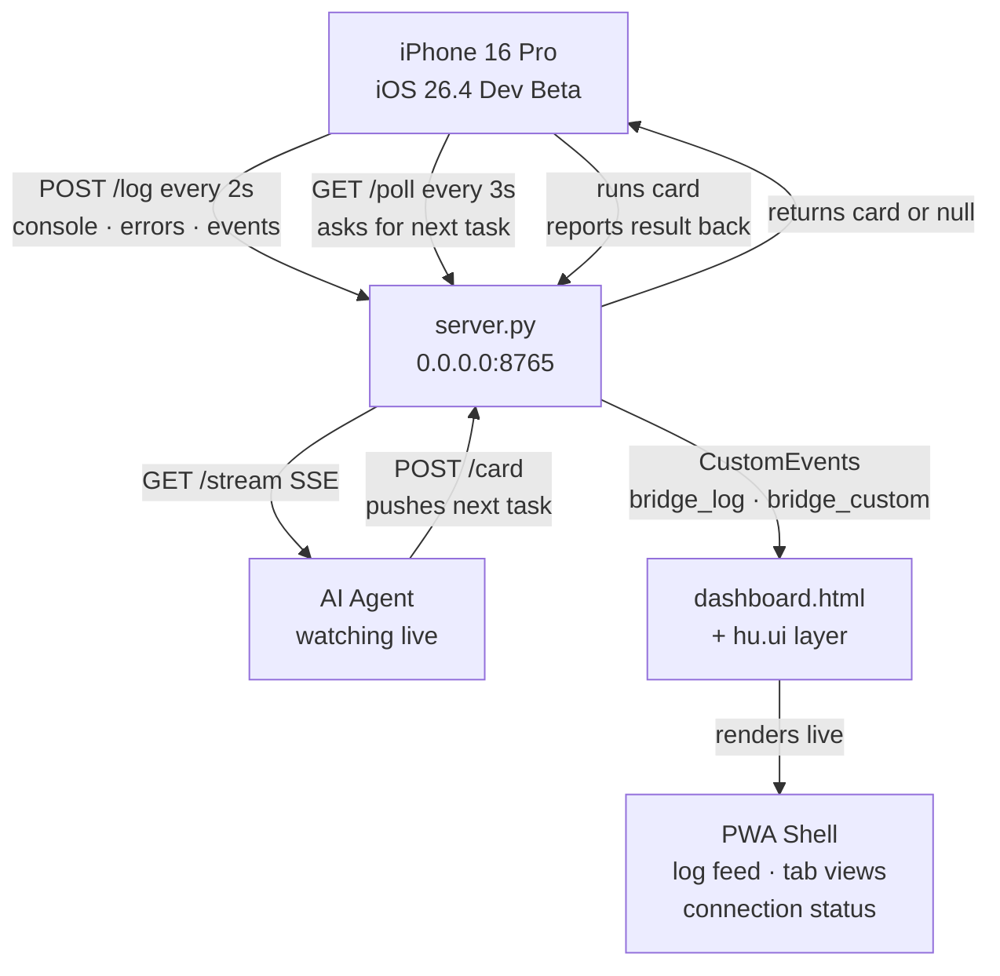

# SFTi DevBridge

### Live iOS PWA ↔ AI Agent Diagnostic Runtime Plugin

-----

## What This Is

DevBridge is a **self-contained diagnostic plugin** — a live development bridge between a Python server and a PWA running on an iPhone over WiFi. The phone ships everything it sees — console output, errors, network events, storage mutations, lifecycle changes — back to the server in real time. The AI agent watches the stream, pushes task cards, and the phone executes them and reports results. No teardown. No feedback delay. No blind spots.

**This is a plugin, not a standalone app.** DevBridge lives under `DevBridge/` inside any workspace. Future builds on this workspace surface DevBridge under **Advanced Settings** as a toggleable diagnostic runtime. When enabled, it provides the AI agent with full observability into the running PWA — console intercept, network tracing, storage inspection, screenshot capture, and remote JS evaluation.

Built for iOS 26.4 Developer Beta. Poll and POST over HTTP only — iOS kills socket connections when the app backgrounds, so the poll loop is the only reliable mechanism. That is expected behavior, not a bug.

-----

## Plugin Integration

DevBridge is designed to be **dropped into any PWA workspace** without modifying the host application's architecture.

### Enabling DevBridge in a Build

1. The `DevBridge/` directory exists at the workspace root
2. The host app includes `<script src="/bridge.js"></script>` before `</body>`
3. The server is started via `python DevBridge/ai.server/server.py`

### For Future Builds

Any PWA built on this workspace can expose DevBridge under **Advanced Settings → Developer Diagnostics**. The integration point is a single script tag — `bridge.js` self-initializes, detects the server URL from its own `<script>` src, and begins telemetry capture and card polling automatically. No configuration required from the host app.

When DevBridge is disabled (script tag removed), the host PWA runs with zero overhead. DevBridge has no runtime dependencies on the host app and injects no globals beyond `window.BRIDGE`.

-----

## File Tree

```
DevBridge/
├── __init__.py                     ← makes DevBridge/ importable as a Python package
├── ai.server/
│   ├── __init__.py
│   ├── server.py                   ← FastAPI bridge server (port 8765)
│   ├── requirements.txt            ← fastapi, uvicorn, sse-starlette
│   └── libs/                       ← vendored Python dependencies
├── client/
│   ├── __init__.py
│   ├── dashboard.html              ← main PWA entry point (Liquid Glass UI)
│   ├── bridge.js                   ← telemetry capture + card poll loop + card execution
│   ├── manifest.json               ← PWA install manifest
│   ├── sw.js                       ← service worker stub (pass-through, no caching)
│   └── tabs/
│       ├── telemetry.html          ← device/runtime stats (CPU, memory, GPU, battery)
│       ├── cards.html              ← card queue & execution history
│       ├── storage.html            ← localStorage/sessionStorage inspector
│       └── network.html            ← real-time latency probe & resource timing
├── hu.ui/
│   ├── __init__.py
│   ├── conf.ui.effects.js          ← all visual parameters (colors, timing, physics)
│   ├── ui.js                       ← canvas mesh, 3D tilt, log card rendering, event bus
│   └── ui.css                      ← layout, animation, typography, iOS safe area
└── ico/
    ├── __init__.py
    └── (SVG icon assets)
```

-----

## Architecture



-----

## Server — `DevBridge/ai.server/server.py`

FastAPI + uvicorn bound to `0.0.0.0:8765`. CORS `allow_origins=["*"]` for local dev.

### API Endpoints

| Route | Method | Purpose |
|---|---|---|
| `/health` | GET | Server status, LAN IP, queue depth |
| `/log` | POST | Receive telemetry from device |
| `/poll` | GET | Device polls — returns next pending card or `{"card": null}` |
| `/card` | POST | Agent pushes a card into the queue |
| `/card/{id}/status` | POST | Device reports card execution result |
| `/cards` | GET | Full card queue state |
| `/logs` | GET | Latest N logs (truncates large payloads) |
| `/stream` | GET | SSE — broadcasts log events + card state changes |
| `/` | GET | Serves `dashboard.html` |

### Key Design

- In-memory ordered card queue. Cards transition `pending → delivered → completed / failed`.
- SSE broadcast uses `put_nowait` — zombie listeners are pruned automatically.
- `/logs` and `/cards` return explicit `JSONResponse` to prevent async serialization hangs.
- All broadcast calls wrapped in `try/except` — no single listener failure can block the event loop.
- Serves `DevBridge/client/` as a static mount at `/`. Dashboard, bridge, tabs, manifest, and SW are all served from this mount.

-----

## Client — `DevBridge/client/bridge.js`

Vanilla JS. No dependencies. Self-initializing.

### Telemetry Capture

Intercepts and ships to `/log`:

| Source | What's Captured |
|---|---|
| `console.*` | All console.log/warn/error/info/debug output |
| `window.onerror` | Uncaught exceptions with stack traces |
| `onunhandledrejection` | Unhandled Promise rejections |
| `fetch` | Method, URL, status, duration (non-bridge requests only) |
| `XMLHttpRequest` | Same as fetch — method, URL, status, duration |
| `localStorage` / `sessionStorage` | setItem and removeItem operations |
| `visibilitychange` | Foreground/background transitions |
| `online` / `offline` | Connectivity state changes |

### Critical Safety Mechanisms

| Mechanism | Purpose |
|---|---|
| `_insideInterceptor` guard | Prevents infinite recursion when intercepted console calls trigger telemetry |
| `_safeFetch()` / `_safeLog()` | Internal methods that bypass ALL interceptors — use the raw, stashed originals |
| `isBridgeUrl()` | Matches both absolute and relative bridge paths (`/log`, `/poll`, `/health`, etc.) to prevent the fetch interceptor from catching bridge traffic |
| Silent error handling | `flush()` and `poll()` failures are silently dropped — NO console calls inside catch blocks |

### Card Types

| Type | Behavior |
|---|---|
| `eval` | Execute arbitrary JS in the browser context |
| `fetch` | Perform a network request from the device |
| `storage_read` | Read a key from localStorage |
| `storage_write` | Write a key to localStorage |
| `reload` / `refresh` | Trigger `location.reload()` |
| `screenshot` | Capture viewport via html2canvas, return PNG dataURL |
| `test` | Run named JS assertions, return `{passed: [], failed: []}` |
| `custom` | Dispatch a `bridge_custom` CustomEvent |

-----

## Dashboard — `DevBridge/client/dashboard.html`

PWA shell with Liquid Glass aesthetic. Served at `/` by the server.

### Core Features

- **Status pill**: Green/red connection indicator with LAN IP display
- **Live log feed**: Real-time log cards from bridge telemetry, color-coded by level
- **Holographic hamburger**: SVG-animated menu trigger in the status bar
- **Animated sidebar**: Slide-out navigation for Dashboard + 4 diagnostic tabs

### Diagnostic Tabs (`DevBridge/client/tabs/`)

| Tab | File | What It Shows |
|---|---|---|
| Telemetry | `telemetry.html` | CPU cores, memory, GPU adapter, battery, screen, UA string |
| Cards | `cards.html` | Card execution history with status, type, timestamp, payload, result |
| Storage | `storage.html` | Storage quota estimate + all localStorage/sessionStorage entries |
| Network | `network.html` | Real-time latency probe (pings `/health`), resource timing log |

Tabs are loaded dynamically via `fetch()` + `innerHTML` injection. Each tab's `<script>` runs in the dashboard's context with access to `window.BRIDGE`.

-----

## UI Layer — `DevBridge/hu.ui/`

Cyberpunk mission control interface. Three files, each with a single responsibility.

### `conf.ui.effects.js`

Every tunable visual parameter lives here and nowhere else. Modify this file to change the feel of the interface.

- `FX.colors` — full palette
- `FX.mesh` — neural mesh canvas parameters
- `FX.tilt` — 3D card tilt behavior
- `FX.cards` — log card animation
- `FX.levels` — per-level color coding
- `FX.timing` — flush/poll/stat intervals

### `ui.js`

Runtime engine. NeuralMesh canvas, 3D tilt, log card rendering, connection state management, queue panel rendering.

### `ui.css`

Layout, animation, typography, iOS safe area padding. Collapses to single-column on mobile.

-----

## Agent Workflow

1. Agent watches `GET /stream` — SSE feed of every log event the phone sends
2. Agent sees something worth probing → `POST /card` with type and payload
3. Server queues card → next phone poll picks it up → phone executes → result POSTed back to `/log`
4. Agent sees result in the stream → queues next card or closes the loop
5. Dashboard shows the full picture: feed, queue state, connection status — all live

### Quick Commands

```bash
# Activate venv and start the server
source DevBridge/.venv/bin/activate
python3 DevBridge/ai.server/server.py

# Push a test card
curl -X POST http://localhost:8765/card \
  -H 'Content-Type: application/json' \
  -d '{"type":"test","payload":{"assertions":{"bridge":"typeof window.BRIDGE !== \"undefined\""}}}'

# Take a screenshot
curl -X POST http://localhost:8765/card \
  -H 'Content-Type: application/json' \
  -d '{"type":"screenshot","payload":""}'

# Force reload the PWA
curl -X POST http://localhost:8765/card \
  -H 'Content-Type: application/json' \
  -d '{"type":"reload","payload":""}'

# Read latest logs
curl http://localhost:8765/logs?limit=10

# Watch live stream
curl -N http://localhost:8765/stream
```

-----

## iOS Constraints

| Constraint | Handling |
|---|---|
| No persistent sockets | HTTP poll loop (GET /poll every 3s) |
| Background kills timers | `visibilitychange` restarts poll/flush loops |
| Battery API restricted | Graceful degradation with privacy notice |
| RAM API restricted | Reports "Restricted" |
| `navigator.connection` missing | Custom latency probe pinging `/health` |
| Service worker caching | Pass-through only — no stale files |

-----

## Build Constraints

- No websockets. Poll and POST over HTTP only.
- Server bound to `0.0.0.0`. Client detects server URL from its own `<script>` tag src.
- CORS allow all origins — local dev tool.
- These three constraints are what killed the previous build. Do not revert them.
