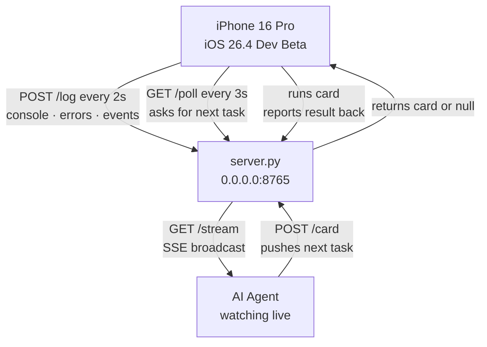

# SFTi DevBridge

### Live iOS PWA ↔ AI Agent Development Loop

-----

## README

A live development bridge between a Python server and a PWA running on an iPhone 16 Pro over WiFi. The phone ships everything it sees — logs, errors, events — back to the server in real time. The agent watches the stream, queues tasks, and the phone runs them and reports back. No teardown. No feedback delay. No blind spots.

Built for iOS 26.4 Developer Beta. Poll and POST over HTTP only — iOS kills socket connections when the app backgrounds, so the loop is the only reliable mechanism. That’s expected behavior, not a bug.

-----

## File Tree

```
sfti.devbridge/
├── system/
│   └── ai.server/
│       ├── server.py           ← Python bridge server
│       └── requirements.txt    ← fastapi, uvicorn
├── client/
│   ├── index.html              ← PWA shell, installs to iOS home screen
│   ├── bridge.js               ← telemetry capture + card poll loop
│   └── manifest.json           ← makes it installable as standalone app
└── antigravity.build.md        ← this file
```

-----

## Architecture



-----

## Build Prompt

Build a live dev bridge. Three files, nothing extra.

**Python server** — receives a continuous stream of logs and errors from the phone, queues tasks for the phone to run, streams everything to a watching agent. Binds to `0.0.0.0` on a fixed port. Prints the LAN IP on startup.

**Client script** — vanilla JS, no dependencies. Intercepts all console output and errors on the page, batches and ships them to the server every 2 seconds. Polls the server every 3 seconds for tasks, runs whatever comes back, reports the result. Single config variable at the top for the server’s LAN IP.

**PWA shell** — one HTML file, loads the client script, shows connection status and a live log feed. Installs to the iOS home screen via a linked `manifest.json`.

No websockets. Poll and POST over HTTP only — iOS kills socket connections in the background. The phone only needs to be foregrounded for the loop to run. That’s expected behavior on iOS 26, not a bug.

Keep it as lean as the first version you built.
