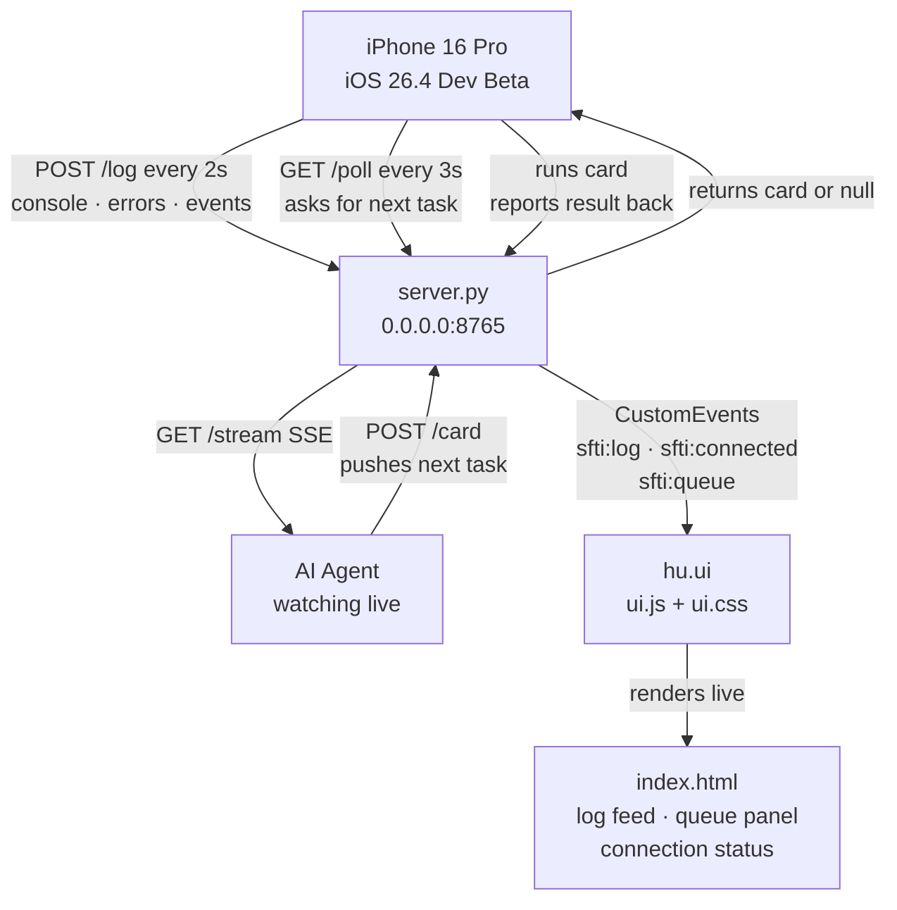

# SFTi DevBridge

### Live iOS PWA ↔ AI Agent Development Loop

-----

## README

A live development bridge between a Python server and a PWA running on an iPhone 16 Pro over WiFi. The phone ships everything it sees — logs, errors, events — back to the server in real time. The agent watches the stream, queues tasks, and the phone runs them and reports back. No teardown. No feedback delay. No blind spots.

Built for iOS 26.4 Developer Beta. Poll and POST over HTTP only — iOS kills socket connections when the app backgrounds, so the loop is the only reliable mechanism. That’s expected behavior, not a bug.

-----

## File Tree

```
sfti.devbridge/
├── index.html                  ← PWA shell, installs to iOS home screen
├── system/
│   └── ai.server/
│       ├── server.py           ← Python bridge server
│       └── requirements.txt    ← fastapi, uvicorn, sse-starlette
├── client/
│   ├── bridge.js               ← telemetry capture + card poll loop
│   └── manifest.json           ← PWA install manifest, drives icon in browser + home screen
├── hu.ui/

│   ├── conf.ui.effects.js      ← all visual parameters in one place (colors, timing, physics)
│   ├── ui.js                   ← canvas mesh, 3D tilt, log card rendering, event bus
│   └── ui.css                  ← layout, animation, typography, iOS safe area
└── ico
│   ├── icon.svg                ← Web Icon and PWA Icon, and Loading Screen Icon.
│   ├── holo.*.svg  ('s)                ← To be build for any small svg needed throughout the app, for tab icons, reference icons, etc, to keep the html file light and fast, template everything.
│   └── __init.py__
└── antigravity.build.md        ← this file
```

-----

## Architecture



-----

## What’s Built — hu.ui

The frontend is a cyberpunk mission control interface. Three files, each with a single responsibility.

### `conf.ui.effects.js`

Every tunable visual parameter lives here and nowhere else. Agent touches this file to change the feel of the interface — colors, particle count, tilt sensitivity, animation speeds, log level color coding, poll/flush timing. No hunting through logic files.

Key parameter groups:

- `FX.colors` — full palette, CSS var equivalents
- `FX.mesh` — neural mesh canvas: particle count, speed, connection distance, mouse repel radius and force
- `FX.tilt` — 3D card tilt: max degrees, perspective, glare opacity, hover scale
- `FX.cards` — log card entry animation: duration, max visible, slide distance
- `FX.levels` — per-level color, label, and dim background for log cards
- `FX.timing` — flush interval, poll interval, stat tick

### `ui.js`

The runtime engine. Reads `conf.ui.effects.js` on init. Exports four functions that `index.html` calls via the event bus.

- **NeuralMesh** — Canvas2D animated particle field. Particles drift, connect via proximity lines, repel from mouse cursor. Color shifts from teal (connected) to red (disconnected) in real time.
- **attachTilt(el)** — Applies 3D perspective tilt to any element tracking mouse position. Called on every log card as it enters the feed.
- **pushLog(entry)** — Renders an incoming log entry as an animated card in the feed. Color-coded by level. Trimmed to `FX.cards.maxVisible`. Auto-scrolls.
- **setConnected(ip, latency)** — Updates the orbital connection ring animation, IP display, latency, and starts the uptime counter.
- **setDisconnected()** — Switches ring and mesh to disconnected state, stops uptime counter.
- **updateQueue(cards)** — Renders the agent queue panel. Shows card type, status badge (pending / delivered / done / failed), and payload preview.

### `ui.css`

Three-column grid layout: sidebar | feed | queue. Orbitron display font + JetBrains Mono body. Full page-load stagger animation. iOS safe area padding via `env(safe-area-inset-top)`. Collapses to single-column feed on mobile. Grain overlay via inline SVG filter.

-----

## How the Agent Interacts with the UI

The agent never touches the UI directly. It talks to `server.py`. The UI reacts.

### Event Bus

`bridge.js` dispatches four CustomEvents on `window`. `index.html` listens and calls `ui.js` exports.

|CustomEvent        |Fired when                     |UI response                                     |
|-------------------|-------------------------------|------------------------------------------------|
|`sfti:log`         |bridge flushes a batch         |`pushLog()` — card enters feed                  |
|`sfti:connected`   |first successful poll response |`setConnected()` — ring animates, mesh goes teal|
|`sfti:disconnected`|poll fails / server unreachable|`setDisconnected()` — ring stops, mesh goes red |
|`sfti:queue`       |poll returns queue state       |`updateQueue()` — queue panel re-renders        |

### Agent Workflow

1. Agent watches `GET /stream` — SSE feed of every log event the phone sends
1. Agent sees something worth probing → `POST /card` with type and payload
1. Server queues the card → next phone poll picks it up → phone executes → result POSTed back to `/log`
1. Agent sees the result in the stream → queues next card or closes the loop
1. UI shows the full picture: feed, queue state, connection status, level counts — all live

### Tuning the UI

To change any visual parameter, edit `hu.ui/conf.ui.effects.js` only. Do not touch `ui.js` or `ui.css` for visual changes. It is the single source of truth for all aesthetic and timing decisions.

-----

## Build Prompt

Build a live dev bridge. Five file groups, nothing extra.

**Python server** — receives a continuous stream of logs and errors from the phone, queues tasks for the phone to run, streams everything to a watching agent via SSE. Binds to `0.0.0.0` on a fixed port. Prints the LAN IP on startup. Routes: `POST /log`, `GET /poll`, `POST /card`, `GET /cards`, `GET /stream`, `GET /health`. CORS allow all.

**Client script** (`client/bridge.js`) — vanilla JS, no dependencies. Intercepts all console output, uncaught errors, and unhandled rejections. Batches and ships to `/log` every 2 seconds. Polls `/poll` every 3 seconds — executes any card that comes back, posts result. Dispatches `sfti:log`, `sfti:connected`, `sfti:disconnected`, `sfti:queue` CustomEvents on window for the UI to consume. Single `SERVER` config variable at the top set to the LAN IP.

**PWA manifest** (`client/manifest.json`) — drives home screen icon and standalone display mode on iOS and Android.

**UI layer** (`hu.ui/`) — already built. Do not regenerate unless explicitly asked. Wire bridge events to ui.js exports in index.html as documented above.

**PWA shell** (`index.html`) — already built. Loads ui.js and bridge.js. Listens for sfti:* events and calls ui.js exports.

No websockets. Poll and POST over HTTP only — iOS kills socket connections in the background. Foregrounded execution only on iOS 26. That’s expected behavior, not a bug.

Server bound to `0.0.0.0`. Client `SERVER` variable set to LAN IP, not localhost. CORS allow all origins. These three things are what killed the previous build.
